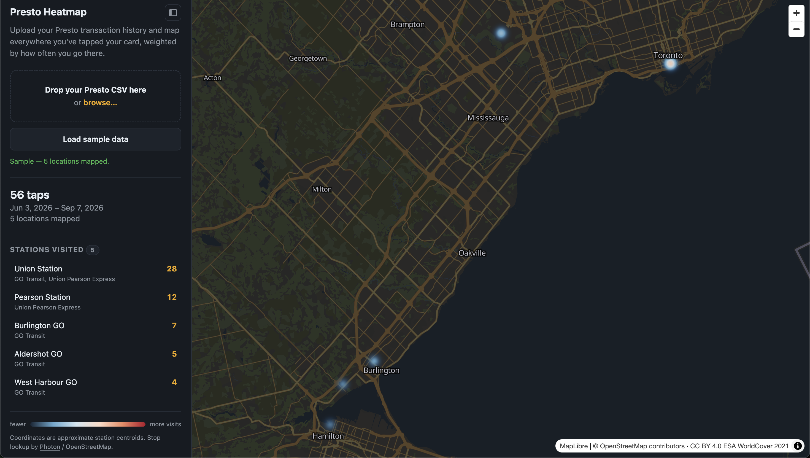

# Presto Heatmap

You upload a Presto (Toronto-area transit card)
transaction-history CSV; it geocodes every station/stop you tapped at and renders a
**Mapbox heatmap weighted by how often you visit each one**, plus a ranked list and the
date range covered by the file.

`presto-sample.csv` is a small **synthetic** dataset used for the "Load sample data" button and the tests. The real
flow works with any valid Presto export.



---

## Quick start

1. **Get a Mapbox public token** (free): https://account.mapbox.com/access-tokens/ — it
   starts with `pk.` See [Mapbox token setup](#mapbox-token-setup) for the recommended
   scopes and URL restrictions on a project-specific token.
2. **Add the token.** Either:
   - open `config.js` and set `window.MAPBOX_TOKEN = "pk...."`, or
   - leave it blank and paste the token into the field the app shows on first load
     (optionally "Remember on this device" → stored in `localStorage`).
3. **Serve the folder over HTTP** (ES modules + `fetch` don't work from `file://`):
   ```bash
   cd presto-heatmap
   python3 -m http.server 8000
   ```
   Any static server works (`npx serve`, VS Code Live Server, etc.).
4. Open <http://localhost:8000>.
5. Click **Load sample data**, or drag your own Presto CSV onto the drop zone.

---

## Mapbox token setup

Create a **project-specific public token** at
<https://account.mapbox.com/access-tokens/create> (e.g. name it `presto-heatmap-web`).

- **Type:** public (`pk.`). This app is browser-only, so the token ships in
  `config.js` — never use a secret (`sk.`) token here.
- **Scopes:** the default public scopes are enough. The minimal working set is
  `styles:read`, `styles:tiles`, `fonts:read` (map style, tiles, and labels). You can
  uncheck `datasets:read` and `vision:read`. There is **no geocoding scope** — the
  Geocoding API (used for surface bus/streetcar stops) is available to any public token
  by default.
- **URL restrictions:** add the origins you'll run from, e.g. `http://localhost:8000`
  for development and your deploy origin (`https://presto-heatmap.example.com`) later.
  Subdomain wildcards are allowed (`https://*.example.com`); port wildcards are not, so
  list each localhost port you use.
  - Caveat: a URL-restricted token rejects requests from `file://` (Origin `null`).
    Always open the app via `http://localhost:…`, which is required anyway (step 3).
- Mapbox has no per-token spend cap; set an account-level billing alert if you want a
  safety net. Geocoding results are cached in `localStorage` after the first lookup.

---

## Getting your own Presto CSV

1. Sign in at <https://www.prestocard.ca>.
2. **Transaction History** → choose a date range → **Download** / export as CSV.
3. Drop that file on the app.

---

## Expected CSV format

Header row plus one row per transaction. Required columns (case/spacing tolerant):

| Column | Used for |
| --- | --- |
| `Date` | e.g. `23 August 2026 12:47 p.m.` — parsed for the overall date range |
| `Service Provider Name` | e.g. `Toronto Transit Commission` — shown as the "system"; `PRESTO System` rows (top-ups) are ignored |
| `Location` | station / stop name — the thing that gets mapped |
| `Type` | present-check only (kept for future filtering) |

Other columns in the standard export (`Sequence Number`, `Discount Sum`, `Amount`,
`Balance`) are ignored.

**Validation:** if the file has no data rows, or any required column is missing, the app
shows a clear error and renders nothing. A file that parses but has no usable location
names is also rejected.

**Rows that are counted but not mapped as their own point:**

- `Location` empty or `0`
- `Location` matching a GO fare zone like `Zone31` (not a place)
- `Service Provider Name` = `PRESTO System` (card loads)

---

## How it works

```
CSV text
  → parse.js      PapaParse → validate headers → per-location visit counts + date range
  → stations.js   normalize messy names ("Union Station - Northbound Platform Tow"
                  → "Union Station"), look up curated coordinates
  → geocode.js    curated hit? else localStorage cache? else Mapbox Geocoding API
  → app.js        build GeoJSON (weight = visits / maxVisits) → Mapbox heatmap +
                  circle layer + sidebar list + date-range summary
```

### Files

| File | Responsibility |
| --- | --- |
| `index.html` | Layout; loads Mapbox GL JS + PapaParse from CDN, then `config.js`, then `js/app.js` (ES module) |
| `css/styles.css` | Dark theme matching the map; sidebar collapses above the map under 820 px |
| `config.js` | `window.MAPBOX_TOKEN` (git-ignored; `config.example.js` is the template) |
| `js/parse.js` | `parsePresto(text)` → `{ stations, dateRange, counts }`; `parsePrestoDate()` |
| `js/stations.js` | `normalize(raw)`, `resolveCurated(raw, provider)`, `CURATED_STATIONS` table |
| `js/geocode.js` | `geocodeStations(stations, token, onProgress)` → `{ resolved, unresolved }` |
| `js/app.js` | Token handling, map setup, upload wiring, rendering |
| `tests/` | `node:test` unit tests for `parse.js` / `stations.js` / `geocode.js` — see [Tests](#tests) |

### Name normalization (`stations.js`)

Presto location strings are inconsistent and often truncated at ~38 chars. `normalize()`:

- strips platform/direction noise — `Union Station - Northbound Platform Tow` → `Union Station`
- collapses GO rail suffixes — `Malton GO Station Rail` → `Malton GO`, `Union Station Rail` → `Union Station`
- rewrites intersections — `College St at Grace St` → `College St & Grace St`
- title-cases shouty TTC names — `ST CLAIR STATION` → `St Clair Station`
- applies explicit aliases — `Toronto- New USBT` → `Union Station Bus Terminal`,
  `Hamilton - HamiltonGOCentre At HunterSt` → `Hamilton GO Centre`

### Geocoding strategy (`geocode.js`)

For each unique location, in order:

1. **Curated table** — `CURATED_STATIONS` in `stations.js` covers all TTC subway stations,
   the four UP Express stops, ~35 GO stations, and everything in the sample file. Instant,
   offline, accurate. This is where the sample resolves 100%.
2. **`localStorage` cache** (`presto_geocode_cache_v1`) — previous Mapbox results, including
   misses, so re-uploads don't re-hit the API.
3. **Mapbox Geocoding API** — query is `"<canonical>, Toronto, Ontario, Canada"` with a
   downtown-Toronto `proximity` bias and a Greater-Golden-Horseshoe `bbox`. Used mainly for
   surface bus/streetcar stops like `Bay St & Queens Quay West`.

Requests run 4 at a time with a progress readout. Anything still unresolved is listed in the
**"Couldn't place"** panel with its visit count, so nothing disappears silently.

**To add a station**, drop an entry into `CURATED_STATIONS` keyed by the lowercased
normalized name, e.g.:

```js
["kennedy station", { lat: 43.7325, lng: -79.2635, canonical: "Kennedy Station", system: "TTC" }],
```

### Map layers (`app.js`)

- `mapbox://styles/mapbox/dark-v11`, fits to the data bounds on load.
- **`stations-heat`** (heatmap): `heatmap-weight` interpolates `visits / maxVisits`;
  intensity & radius grow with zoom; opacity fades out past zoom 12 so individual points
  take over.
- **`stations-point`** (circles, from zoom 11): radius scales with `visits`; click → popup
  with name, visit count, system(s), and the first→last tap dates for that stop.
- Sidebar station list is click-to-fly-to; the header icon button hides/shows the sidebar
  (state persisted in `localStorage`).

---

## Known limitations

- Coordinates are approximate station centroids — fine for a heatmap, not for routing.
- TTC / GO / UP Express taps at Union are merged into one `Union Station` point (they're
  within ~150 m); this makes Union the natural hot spot, which is accurate.
- GO fare-zone rows (`Zone31`, …) can't be placed and are excluded from the map.
- Surface-stop geocoding depends on the Mapbox Geocoding API — it counts against your
  account's free monthly quota (100k requests) and needs network access. Results are
  cached after the first lookup.
- `Bloor Station` is ambiguous (UP Express vs TTC Bloor-Yonge); it's disambiguated by the
  row's service provider.

---

## Tests

Automated unit tests use Node's built-in test runner (`node:test`) — no browser and no
network required.

```bash
npm install   # pulls in PapaParse as a dev dependency, for tests/parse.test.js
npm test
```

| File | Covers |
| --- | --- |
| `tests/stations.test.js` | `normalize()` (truncation stripping, GO/intersection rewrites, alias table, non-place filtering) and `resolveCurated()` (curated hits, uncurated misses, the Bloor Station TTC/UP disambiguation, and a sanity check that every curated entry has plausible southern-Ontario coordinates) |
| `tests/parse.test.js` | `parsePrestoDate()`; `parsePresto()` validation (missing columns, no data rows, nothing geocodable, tolerant header casing/whitespace); the [5-row fixture](tests/fixtures/presto-5-rows.csv) and the full sample (62 rows → 56 taps across 5 stations, `3 Jun – 7 Sep 2026`, Union Station top at 28) |
| `tests/geocode.test.js` | `geocodeStations()` with `fetch`/`localStorage` mocked: curated stations skip the network, uncurated ones call the Geocoding API and get cached, no-match / HTTP-error / offline responses land in `unresolved` with a reason, and every input station ends up counted exactly once |

`tests/fixtures/presto-5-rows.csv` is the header plus the first 5 data rows of
`presto-sample.csv`, used as a small hand-checkable fixture alongside the full sample.

Manual end-to-end check: serve the folder, add a real `pk.` token, click **Load sample
data** → heatmap over the Toronto–Hamilton GO corridor, Union Station hottest, summary line
shows `56 taps · 3 Jun 2026 – 7 Sep 2026`; zoom in for circles + popups; drag the CSV
file itself for the same result; drag an unrelated CSV for a validation error.
